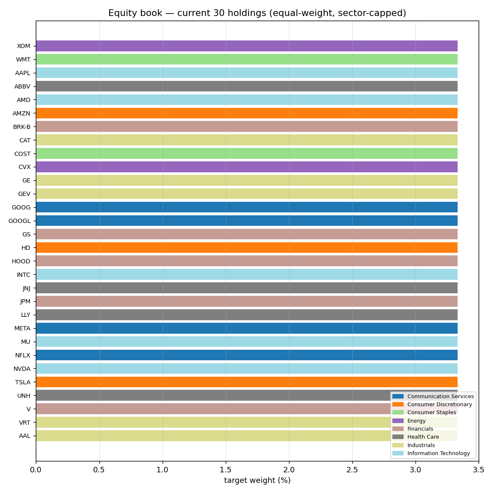
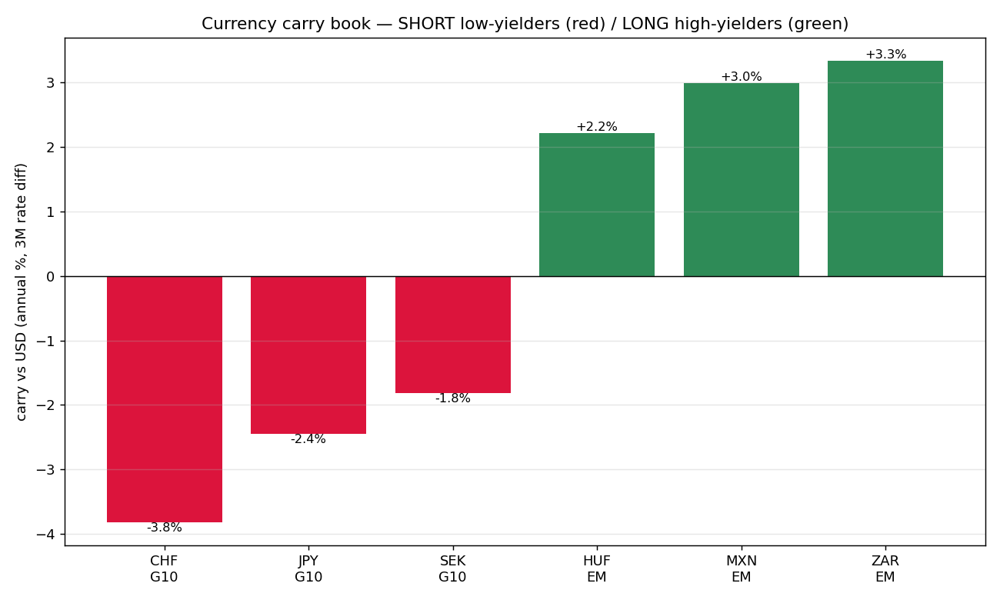
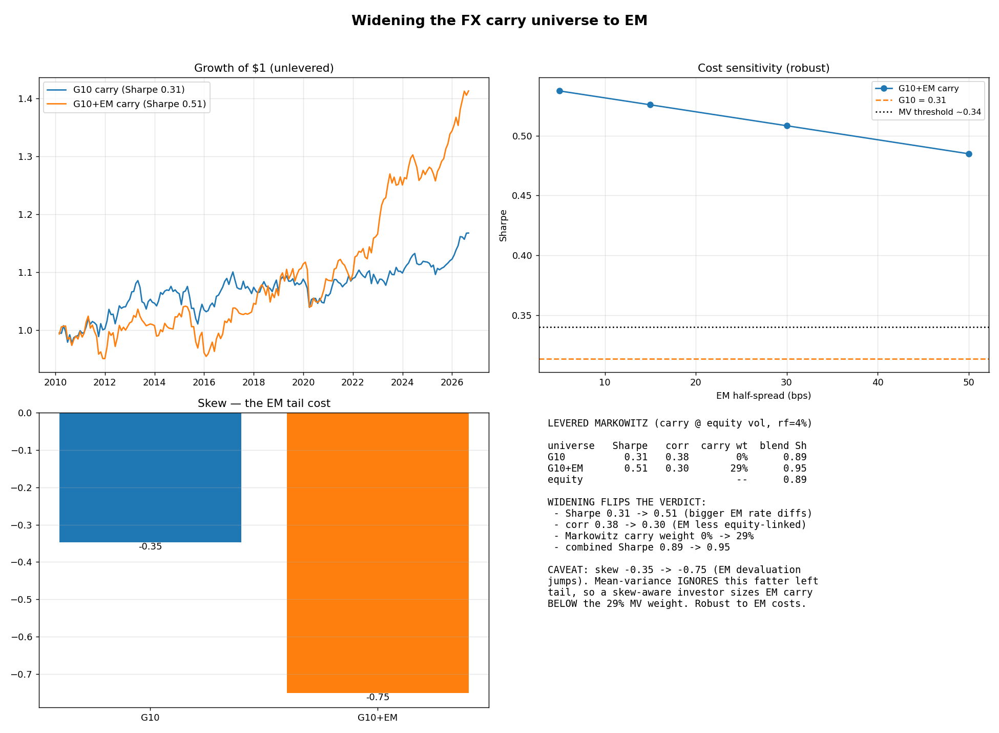
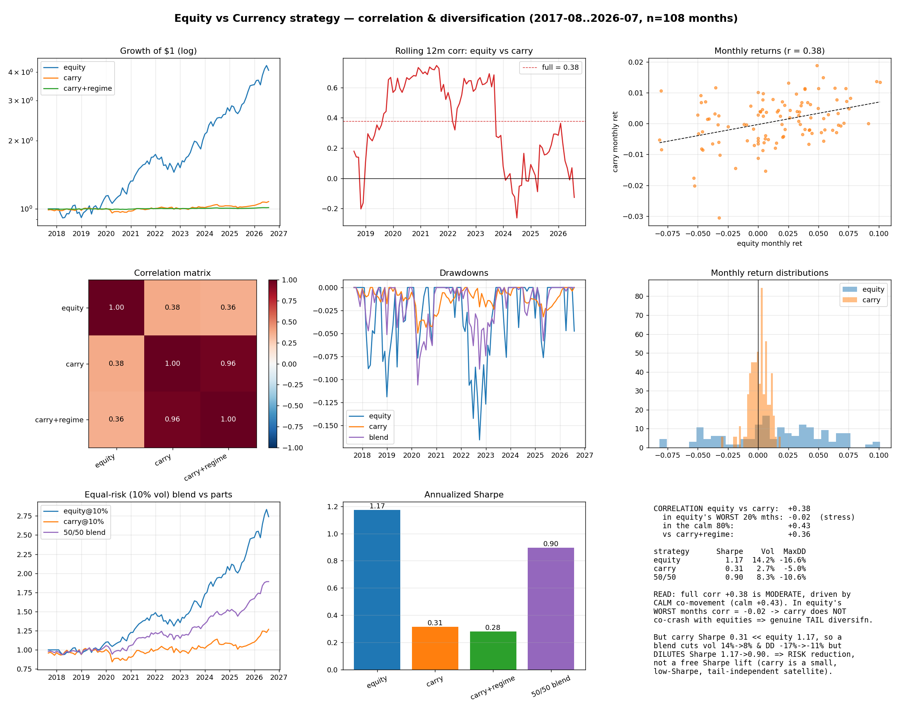
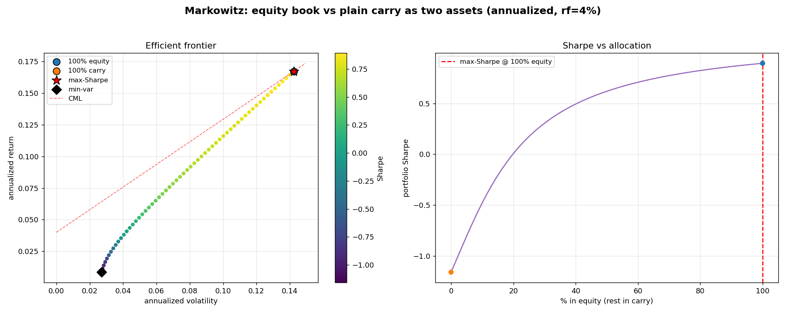

% The Two Strategies — A Complete, Plain-English Guide
% autoPortfolio: Equities + Currencies
% 2026-08-08

# How to read this document

You run **two separate strategies**:

1. A **stock (equity)** portfolio — buys a basket of large US companies.
2. A **currency (FX)** portfolio — earns the interest-rate gap between countries.

They are kept separate on purpose. This guide explains **each one from
scratch**, shows **exactly what you hold**, and then shows **how they work
together**. No finance background assumed — every term is defined the first time
it appears.

\newpage

# Part 1 — The Equity (Stock) Strategy

## The one-sentence version

> Hold an **equal-weighted basket of the 30 most-traded US stocks**, refreshed
> every quarter, and **automatically dial risk down when markets get stormy.**

That's it. It's deliberately simple, because — after testing dozens of clever
alternatives — simple consistently won.

## The four design choices (and why each one)

**1. Which stocks? The 30 most *liquid* names.**
"Liquid" = easy to buy and sell in size without moving the price (lots of daily
trading volume). We pick the 30 highest-volume eligible US stocks. Why liquid?
Because trading costs are tiny for them, and the strategy stays realistic to run.

**2. How much of each? Equal weight (1/30 each).**
Every stock gets the same share of the money — about 3.3% each. We tested
"smarter" weighting schemes (put more in lower-risk names, optimize the mix,
etc.). **Equal weight beat all of them** out-of-sample. This is a famous result:
simple 1/N is remarkably hard to improve on.

**3. Diversified across sectors (max 5 per sector).**
No more than 5 of the 30 can come from any one industry (tech, healthcare,
energy, …). This stops the book from becoming an all-tech bet. Testing confirmed
the edge comes from *being broad and liquid*, **not** from a sector bet.

**4. A 15% "volatility target" safety overlay.**
Volatility = how much prices are jumping around. We measure the book's recent
volatility; when it spikes (turbulent markets), we **automatically move part of
the book to cash** to keep risk near a steady 15% per year. When calm, we're
fully invested. This roughly **halved the worst drawdown** with no loss of
return. (It only ever de-risks — it never borrows to add risk.)

## What you actually hold right now

The current book — **30 stocks across 8 sectors, ~3.3% each:**

These are household names (Apple, Microsoft-scale companies, big banks,
healthcare, energy, industrials). The **point-in-time** discipline matters: the
backtest always used the names that were *actually* the most liquid *at each past
date* — not today's winners looked up with hindsight — so the results aren't
flattered by "survivorship bias."

## How it has performed (honestly measured)

- **Return:** ~16–17% per year over the test period.
- **Sharpe ratio ~1.1.** (Sharpe = return per unit of risk; higher is better.
  Above 1 is good.)
- **Worst drawdown ~ −17%** (the deepest peak-to-trough fall), roughly *half*
  what it would be without the volatility overlay.
- Every number is after realistic trading costs and with the point-in-time
  discipline above.

**Caveat:** the test period was a strong bull market for big US stocks, so the
~16% is partly a tailwind that won't repeat every year. The *structure* (broad,
liquid, equal-weight, risk-managed) is what we trust — not the exact number.

\newpage

# Part 2 — The Currency (FX) Strategy

## First: how does trading a currency even work?

You never buy a currency by itself — you always trade one **against** another
(a "pair"). Buying euros means paying with dollars; you profit if the euro rises
*relative to* the dollar. So a currency bet is really a bet on **one economy vs.
another**.

Every currency also pays an **interest rate** (set by its central bank). This is
the key to the whole strategy.

## The core idea: "carry"

> Hold the currencies that **pay high interest**, fund them by borrowing (shorting)
> the currencies that **pay low interest**, and pocket the difference.

It's like borrowing where money is cheap and depositing where it pays well — and
keeping the gap. That gap is called **carry**.

- **"Long" a currency** = you own it, and earn its interest.
- **"Short" a currency** = you've borrowed and sold it, and pay its interest.
- Do both at once and the book is **"dollar-neutral"** — you're not betting on
  the dollar overall, only on high-rate currencies beating low-rate ones.

In theory the high-rate currency should weaken enough to cancel your gain. In
practice it usually **doesn't** — a well-documented quirk — and that persistent
gap is the profit we harvest.

## What you actually hold right now

Each month we rank the currencies by their interest rate versus the US dollar,
then **go long the top few and short the bottom few:**

Reading it: we're **long** the high-yielders (currently Hungarian forint, Mexican
peso, South African rand — all paying 2–3%+ *more* than the dollar) and **short**
the low-yielders (Swiss franc, Japanese yen, Swedish krona — paying *less* than
the dollar). We collect the difference for holding this book.

## Why the universe includes emerging markets (EM)

Originally we used only the 10 major "G10" currencies (euro, yen, pound, …). But
their interest rates are all similar now, so the carry gap is small. **Adding 8
emerging-market currencies** (Mexico, South Africa, Poland, Hungary, Korea, Chile,
Israel, Czechia) — which pay much higher rates — roughly **doubled** the
strategy's risk-adjusted return. That's why the "long" side above is all EM.

## How it has performed — and its one real danger

- **Sharpe ~0.5** for the widened (G10+EM) book — a *modest* but real edge.
  (Unlevered it earns only a few % a year; carry is normally run with leverage.)
- **The danger — "carry crashes":** high-yield currencies (especially EM) can
  **suddenly collapse** in a panic (a devaluation, a crisis), all at once. So the
  strategy earns steady small gains, then occasionally takes a sharp loss. The
  numbers call this **negative skew** (−0.8 for the EM book): more downside
  surprises than upside. This is the price of the higher return.

## A safety feature: the crash-regime detector

Because carry's whole weakness is those crashes, we built a **regime detector**
(a Hidden Markov Model — a statistical tool that infers whether markets are in a
"calm" or "stressed" state from clues like rising volatility and investors
rushing into safe-haven currencies). When it senses stress, it **cuts the book's
exposure**. It doesn't add return, but it **shrinks the crash drawdowns** — a
drawdown-control tool for the nervous.

\newpage

# Part 3 — How the Two Strategies Work Together

The reason to run both is **diversification**: if they don't move together,
combining them smooths the ride.

## What the analysis shows

**They're largely independent — especially when it matters.**
Their overall correlation is a mild +0.3 (correlation runs −1 to +1; 0 = no
relationship). Crucially, **in the stock market's *worst* months, the correlation
is ~0** — the currency book does **not** crash together with stocks. That's
genuine "tail" protection.

**But currency doesn't add *return*, only *risk reduction*.**
We ran a **Markowitz optimization** (the standard math for finding the best mix
of assets by trading off return against risk):

- With only **G10** currencies, the optimizer put **0%** in currency — its return
  was simply too low to bother, even accounting for diversification.
- With the **EM-widened** currency book, the optimizer allocates about **29% to
  currency**, lifting the combined risk-adjusted return (Sharpe **0.89 → 0.95**).

## The honest bottom line

- **Stocks are the engine** of returns.
- **Currency (EM carry) is a diversifying satellite** — it won't sink with stocks
  in a crash, and it earns enough (once EM is included) to justify a real slice.
- **But size it with care:** the Markowitz 29% ignores carry's crash tail. A
  cautious investor should hold **less than 29%** in currency, precisely because
  of those occasional sharp EM losses.

# One-page summary

| | **Equity strategy** | **Currency strategy** |
|---|---|---|
| **What it does** | Owns 30 big liquid US stocks | Long high-rate / short low-rate currencies |
| **Why it works** | Broad, cheap, diversified market exposure | Harvests the interest-rate gap ("carry") |
| **Holdings now** | 30 names, 8 sectors, ~3.3% each | Long HUF/MXN/ZAR, short CHF/JPY/SEK |
| **Rebalance** | Quarterly | Monthly |
| **Safety feature** | 15% volatility target (de-risk to cash) | Crash-regime detector cuts exposure |
| **Return** | ~16%/yr, Sharpe ~1.1 | Sharpe ~0.5 (EM-widened) |
| **Main risk** | Broad market fall | Sudden "carry crash" (EM devaluation) |
| **Role in the mix** | The return engine | Tail-independent diversifier (~size <29%) |

*All results are after realistic costs, use point-in-time data (no hindsight),
and were validated on held-out periods and against random-signal "null" tests to
avoid fooling ourselves.*
